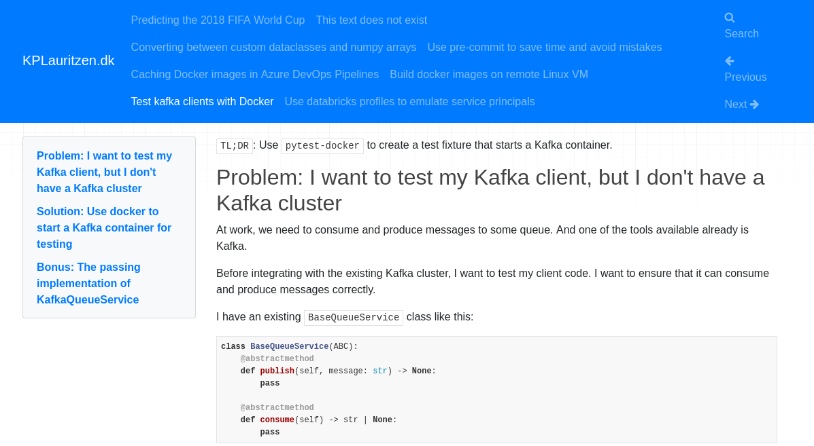
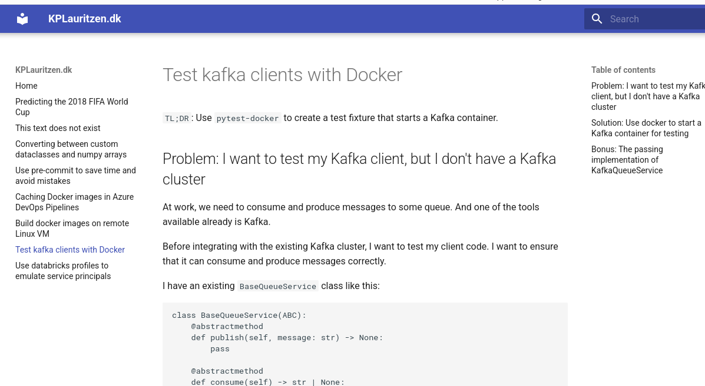

# Migrating static site from Jekyll to MkDocs

## Intro

I have posted (very) few post to my [blog](http://www.kplauritzen.dk) over the years.
Recently, one of the things holding me back from posting is that I can't really build it locally any more.
I'm using [Github Pages](https://pages.github.com/), and although it probably very easy to use, I just use it so rarely that I don't really know what is going on.

My brief guide says to run `bundle install`, but I don't have `bundle` installed. I also don't know what it is.
[Github](https://docs.github.com/en/pages/setting-up-a-github-pages-site-with-jekyll/testing-your-github-pages-site-locally-with-jekyll) tells me to install Jekyll and Ruby. I don't have either of them.

At work I use Python a lot, and I have created a few docs sites with [MkDocs](https://www.mkdocs.org/), with [Material for MkDocs](https://squidfunk.github.io/mkdocs-material/) helping out in making everything pretty. I want to use that tool-stack instead.
All the content is markdown anyway, so it should not be too bad.

## Build locally

I start by cloning <https://github.com/KPLauritzen/kplauritzen.github.io> and opening it VSCode.

Let's create a justfile to document how to interact with the repo.

```justfile
install
 uv sync --all-extras
 uv run pre-commit install

lint:
 uv run pre-commit run --all-files
```

None of this works yet, there is no Python project, but it is a start.

I set up `pyproject.toml` with `uv init` and add some packages with `uv add pre-commit mkdocs mkdocs-material`.

Now I just need the most basic config for MkDocs and we are ready to serve some HTML!

```yaml
site_name: KPLauritzen.dk
docs_dir: _posts
```

I can see my site locally with `mkdocs serve`

It's terrible, but it works! I add that as a command in the `justfile`


## Slightly prettier

How little effort can I put in to make this tolerable?

- Add a theme to `mkdocs.yml`

    ```yaml
      theme: material
    ```

- Move `index.md` to `posts_` so we don't start with a 404 error.

That's it, now it actually looks serviceable.


There is A BUNCH of improvements that could be helpful, but it is too much fun to do. I will save some of that for a rainy day.

For now, I will just try to create a github workflow to publish this.

## Publish again to Github Pages

I already have a Github Action called `jekyll.yml`. Let's delete that and make a new one.

I start by stealing the basic outline from [mkdocs-material](https://squidfunk.github.io/mkdocs-material/publishing-your-site/#with-github-actions).
After that, I follow the guide to [uv in Github Actions](https://docs.astral.sh/uv/guides/integration/github/).

This is the result:

```yaml
name: ci 
on:
  push:
    branches:
      - master 
      - main
permissions:
  contents: write
jobs:
  deploy:
    runs-on: ubuntu-latest
    steps:
      - uses: actions/checkout@v4
      - name: Configure Git Credentials
        run: |
          git config user.name github-actions[bot]
          git config user.email 41898282+github-actions[bot]@users.noreply.github.com
      - name: Install uv
        uses: astral-sh/setup-uv@v5
      - run: echo "cache_id=$(date --utc '+%V')" >> $GITHUB_ENV 
      - uses: actions/cache@v4
        with:
          key: mkdocs-material-${{ env.cache_id }}
          path: .cache
          restore-keys: |
            mkdocs-material-
      - run: uv run mkdocs gh-deploy --force
```

EDIT: After publishing I had some problems with my custom domain, `kplauritzen.dk`. Every time I ran `mkdocs gh-deploy` it wanted to deploy to `kplauritzen.github.io` instead.

I think the solution is to create a `CNAME` file in `_posts/` as that will get picked up during the build.
See the [docs](https://www.mkdocs.org/user-guide/deploying-your-docs/#custom-domains).
