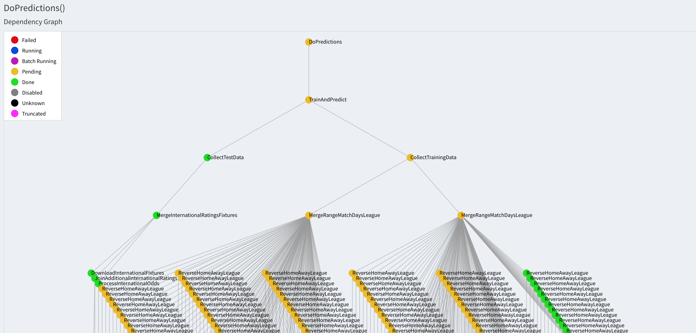

# Predicting the 2018 FIFA World Cup

`TL;DR`: Check the predictions at the bottom of the page, and see the code on [GitHub](https://github.com/KPLauritzen/worldcup2018).

The FIFA World Cup 2018 is starting tomorrow in Russia.
I joined a competition at work to predict the final score of all the games of the tournament, but since I don't know anything about football (and do know *something* about machine learning), I thought it would be fun to build a simple model to do the predictions.

## The challenge

I want to guess the final score of all matches. There is partial credit for just guessing the match winner, so if it is not possible to guess the final score I want to err towards guessing the winner.

I see two main challenges:

1. I have to predict how the national teams will perform. Each team usually plays less than 10 games a year, so there is not a lot of data to go on.

2. I have to predict scores instead of just outcomes. So this is not a classification problem, but instead a regression problem. I'm not so confident in that class of machine learning problems, so this will be a fun exercise.

## Initial thoughts

I will be using the team ratings from the game FIFA 18 as my training features. They are available for both international and club games and they are updated every week.
For each team there are ratings for attacking ('ATT'), midfield ('MID'), defending ('DEF') and overall ('OVR').
MY hypothesis is that if I find a pattern in how many goals a 85 ATT teams scores against a 74 DEF team, this will hold for both clubs and international teams. In this way I will be able to train on many games from for example premier league.

Additionally, I will include the implied odds from bookmaker odds for each match outcome. I hope this will make it more likely to predict the correct winner as this also gives some points in my office tournament.

## Data Sources

I found FIFA team ratings at [FIFA index]( https://www.fifaindex.com/ ). This was not available as a download, so I had to scrape the ratings.

The final scores of matches for several European leagues are available at [Football-data.co.uk]( http://www.football-data.co.uk/ ). Here the data is available as a `.csv` file, so this couldn't be easier. It even includes bookmaker odds!

The odds from the world cup games was downloaded and scraped from [Odds Checker](https://www.oddschecker.com).

The fixtures for the world cup was downloaded from [Fixture Download](https://fixturedownload.com).

## My approach

I wanted to use this as an opportunity to use [luigi](https://luigi.readthedocs.io/en/stable/) for handling the data dependencies. This is definitely overkill for a simple project like this, but it was still a good testing grounds.
To illustrate, here is a portion of the final dependency graph for creating the training dataset.



You can check out the code at [my GitHub](https://github.com/KPLauritzen/worldcup2018).

To summarize the training data creation:

1. For a certain league (e.g. Premier League) I download the weekly team ratings pages from FIFA Index, using `urllib`.

2. I extract the ratings for each team with `beautifulsoup4`.

3. I download the results of all games in the league from football-data. This dataset includes bookmaker odds. I use the Bet365 odds.

4. I merge the ratings for home and away teams onto the results, using `pandas`. I merge on team name and date.
    - NB: The team names are not consistent between the two data sources, so I had to normalize the names to be able to join on them.

5. To avoid having to account for home field advantage (which won't be a thing at the world cup - except for Russia), I add all matches AGAIN with home and away team reversed. This should make home and away teams symmetric.

6. Repeat steps 1-5 for other leagues if desired. It could be beneficial to include lower tier leagues to have examples of ratings like the lower tier national teams.

## Training

I've not really explored the possibilities very carefully here. I've trained a Ridge regression in `scikit-learn` with home AND away goals as the targets.
It works the best of all the methods I tried with a mean absolute error of about 0.9. So on average my predictions are about 1 goal off the correct answer.

## Prediction data

The data gathering setup is very similar to the process described above for club games.

One issue is that the predictions are not integers but floats. How do you interpret a prediction of 1.43 against 1.18? Should that be rounded to 1-1? How about 0.6 against 1.4? Is it still a 1-1 if I predict one team to have 0.8 goals advantage?

I think there is a smart answer to this, maybe using the bookmaker odds to decide if this should be a draw or if one team winning is more likely.

I haven't figured this out, and I would love some more input. Please reach out if you have an idea.

## Actual predictions

No more beating around the bush. Here are my final predictions:

```
| team_home    | goals_home | goals_away | team_away    |
|--------------|------------|------------|--------------|
| Russia       |          2 |          1 | Saudi Arabia |
| Egypt        |          0 |          2 | Uruguay      |
| Morocco      |          1 |          1 | Iran         |
| Portugal     |          1 |          2 | Spain        |
| France       |          2 |          1 | Australia    |
| Argentina    |          2 |          1 | Iceland      |
| Peru         |          1 |          1 | Denmark      |
| Croatia      |          2 |          1 | Nigeria      |
| Costa Rica   |          1 |          1 | Serbia       |
| Germany      |          2 |          1 | Mexico       |
| Brazil       |          2 |          1 | Switzerland  |
| Sweden       |          1 |          1 | South Korea  |
| Belgium      |          2 |          1 | Panama       |
| Tunisia      |          1 |          2 | England      |
| Colombia     |          2 |          1 | Japan        |
| Poland       |          1 |          1 | Senegal      |
| Russia       |          1 |          1 | Egypt        |
| Portugal     |          2 |          1 | Morocco      |
| Uruguay      |          2 |          0 | Saudi Arabia |
| Iran         |          1 |          2 | Spain        |
| Denmark      |          2 |          1 | Australia    |
| France       |          2 |          1 | Peru         |
| Argentina    |          2 |          1 | Croatia      |
| Brazil       |          2 |          0 | Costa Rica   |
| Nigeria      |          1 |          1 | Iceland      |
| Serbia       |          1 |          1 | Switzerland  |
| Belgium      |          2 |          1 | Tunisia      |
| South Korea  |          1 |          2 | Mexico       |
| Germany      |          2 |          1 | Sweden       |
| England      |          2 |          1 | Panama       |
| Japan        |          1 |          1 | Senegal      |
| Poland       |          1 |          1 | Colombia     |
| Uruguay      |          1 |          1 | Russia       |
| Saudi Arabia |          1 |          2 | Egypt        |
| Iran         |          1 |          2 | Portugal     |
| Spain        |          2 |          1 | Morocco      |
| Denmark      |          1 |          2 | France       |
| Australia    |          1 |          1 | Peru         |
| Nigeria      |          1 |          2 | Argentina    |
| Iceland      |          1 |          2 | Croatia      |
| Mexico       |          1 |          1 | Sweden       |
| South Korea  |          1 |          2 | Germany      |
| Serbia       |          1 |          2 | Brazil       |
| Switzerland  |          1 |          1 | Costa Rica   |
| Japan        |          1 |          1 | Poland       |
| Senegal      |          1 |          1 | Colombia     |
| Panama       |          1 |          1 | Tunisia      |
| England      |          1 |          1 | Belgium      |
```

## Related work

There is a [very nice paper](https://arxiv.org/pdf/1806.03208.pdf) by Andreas Groll *et al.*, doing the same thing but better and with much more rigor.

And this great tweet in response to the paper:

> Your first mistake was using fifa rankings...they are an absolute horrible indicator of a countrys actual ability

[Marko Bilal (@markobilal)](https://twitter.com/markobilal/status/1006666154503540737?ref_src=twsrc%5Etfw) on Twitter

Of course, the ever interesting [FiveThirtyEight](http://www.fivethirtyeight.com) have also tried their hand at [predicting the world cup](https://projects.fivethirtyeight.com/2018-world-cup-predictions/). They also publish [their methodology](https://fivethirtyeight.com/features/how-our-2018-world-cup-predictions-work/) and [their data](https://github.com/fivethirtyeight/data/tree/master/world-cup-2018). How can you not love them?
