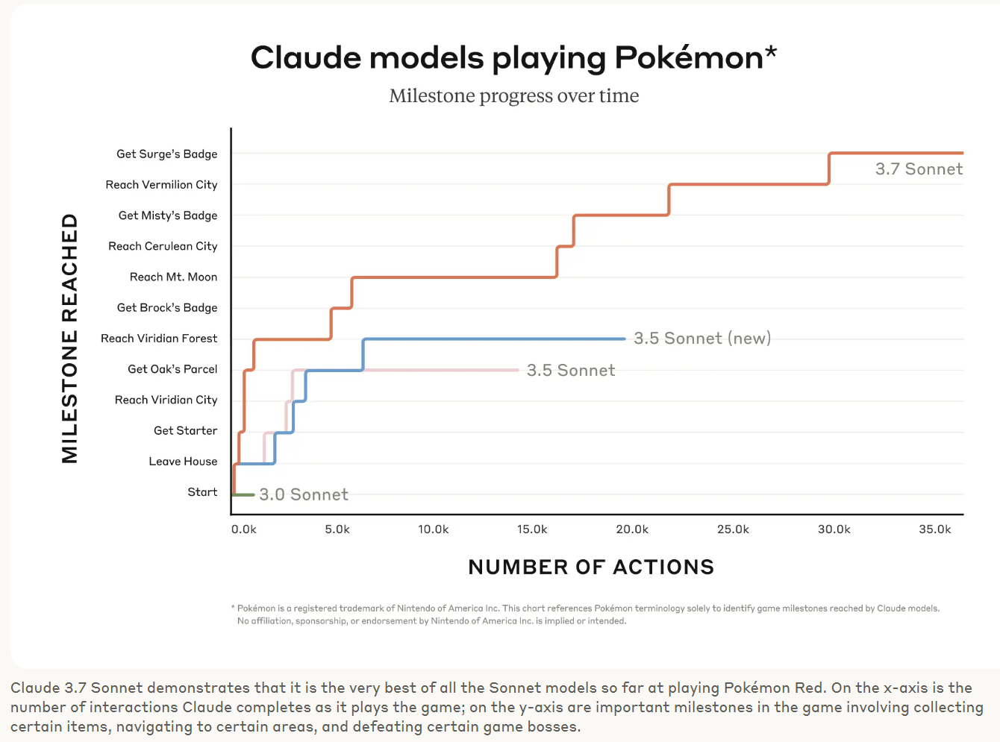

---
tags:
    - blog
    - llm
    - claude
    - date/2025/02/26
date: 2025-02-26
---
# Antropics Claude 3.7 Sonnet is released

Yesterday, Anthropic released their new LLM, [Claude 3.7 Sonnet](http://www.anthropic.com/news/claude-3-7-sonnet).

For a run-through of the vibes, I always wait for [Zvi Mowshowitz](https://thezvi.substack.com/p/time-to-welcome-claude-37/)'s review.

However, there are a few fun highlights here. 

## ClaudePlaysPokemon

Back in the pre-historic era when I was at Uni, I lost a lot of time to [Twitch Plays Pokemon](https://en.wikipedia.org/wiki/Twitch_Plays_Pok%C3%A9mon).
I was facinated by the idea of a collective playing a game, and the chaos that ensued. A whole mythos got built up, and it was a lot of fun to follow and occasionally spam in the chat. 

Anthropic has started using "How far can Claude get in Pokemon" as one of their benchmarks, but they have also set up an emulator streaming on Twitch.

You can watch [ClaudePlaysPokemon](https://www.twitch.tv/claudeplayspokemon) and see how far the model can get.

## How many "R"s in Strawberry?

There is an easter egg in the system prompt, where if you ask "How many R's in Strawberry?" it will generate a little website that counts the number of R's in the word strawberry.

I have pasted the HTML directly below (simultaneously testing how markdown with HTML gets handled by MkDocs)

<!DOCTYPE html>
<html>
<body>
  <!-- Strawberry Counter (isolated styling) -->
  

    
🍓

    
Click the strawberry to count!

    

    

  

  <!-- Add the keyframes for bounce animation -->

</body>
</html>