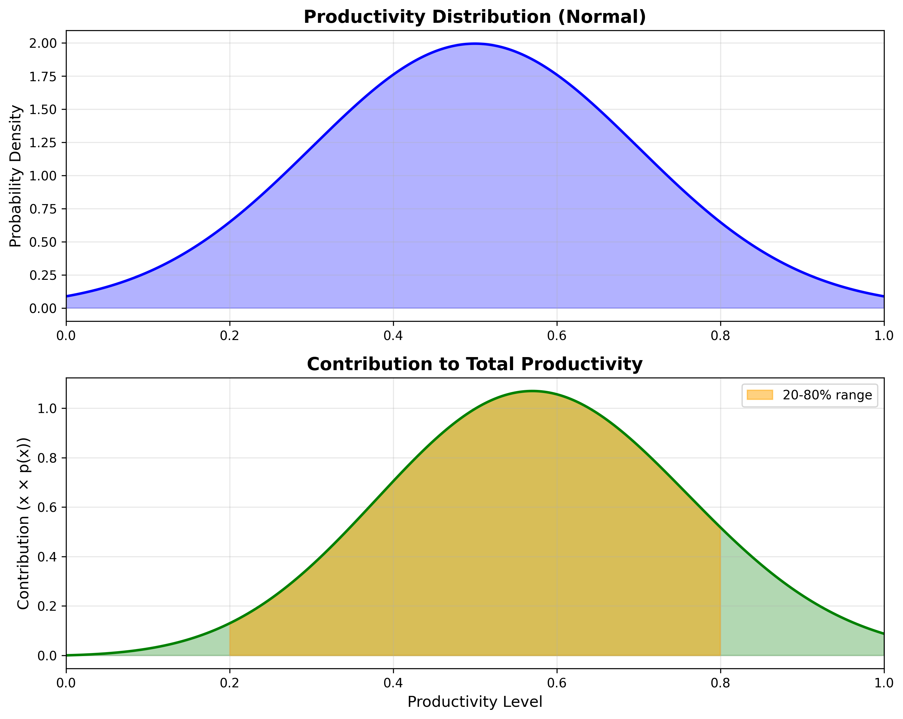

---
tags:
- fred
date: 2025-12-15
---

# Fred

My good friend, Fred, has started [blogging on substack](https://rubberbottom.substack.com) recently. 

Fred has MANY skills. He has been DOING things, been poking at the world with every stick he has ever found, changed careers to something more exciting more times than I can easily express.

He could probably express it. One skill he has, maybe the thing he is the best at, is writing. 

Actually, there is at least one thing I'll rank higher than Fred's writing. That is a good Fred rant. And his blog feels like a series of particularly high-quality rants, interspersed with actual, honest-to-god, advice on being a good human. 

So I'll drop whatever else I'm doing whenever I see a \[FRED\] post in my [RSS feed](./2025-11-25-reading-rss-feeds.md), get comfy in my chair, and enjoy the fireworks. 

You might need an example:
How about [this one](https://substack.com/home/post/p-180691141), opening on the toilet at the therapists office, setting the scene like this
> I’ve just suffered through part bowel movement, part catholic exorcism…
> 
> Resulting in one of those near-mythological Fantasy Epic wipes that need more paper than all of Robert Jordan’s Wheel Of Time series.
> 
> This is a Sisyphean task straight out of Greek mythology - pushing a brown tar-like with inexplicable-grains-in-it boulder uphill every day until the world runs out of patience and paper.

IS THAT A HOOK OR WHAT?

Ok, so he is also incredibly crass. That just makes it better. 

## On having a Gooch Day

His most [recent post](https://rubberbottom.substack.com/p/why-most-days-are-unproductive) is about productivity. 

I think you should read the post, but the shortest possible summary is:
- Suppose your daily produtivity is following a truncated normal distribution, from 0% to 100% productive days. 
- Then you will have a few days in a month that feel very productive, a few that feel not-at-all productive, and most days will be in-between. Those are the Gooch Days.

Fred points out that you can't rely on the super productive days, they are too rare. Instead, the real hero is the Gooch. This is where progress is made, because this is where the volume is at. 

I wanted to play around with this intuition a little bit, and since [Python is my hammer and everything is a nail](https://www.maragu.dev/blog/go-is-my-hammer-and-everything-is-a-nail), I fired up some matplotlib. 

Given a normal distribution with a mean of 50% and a standard deviation of 20%, we can approximate the histogram Fred showed. And if we want to know how much each day contributes to the total productivity, we can plot $x \times p(x)$, the expected contribution. For me, it helped to think of Expected Value calculations: Imagine you make a bet that will give 100 EUR if you win, and you have a 20% chance to win. The expected value is $100 \times 0.2 = 20$ EUR.

So now the height on the histogram is not representing the frequency of days with that amount of productivity. Instead it represents how much those days contribute to the overall productivity (of the month/year/whatever).

I've plotted both the assumed productivy distribution and the contribution below. 

Note the area with a slightly off-putting color, between 20% and 80% productivity, the Gooch Days. All together, they represent 87% of your total productivity! They are basically all that matter. 